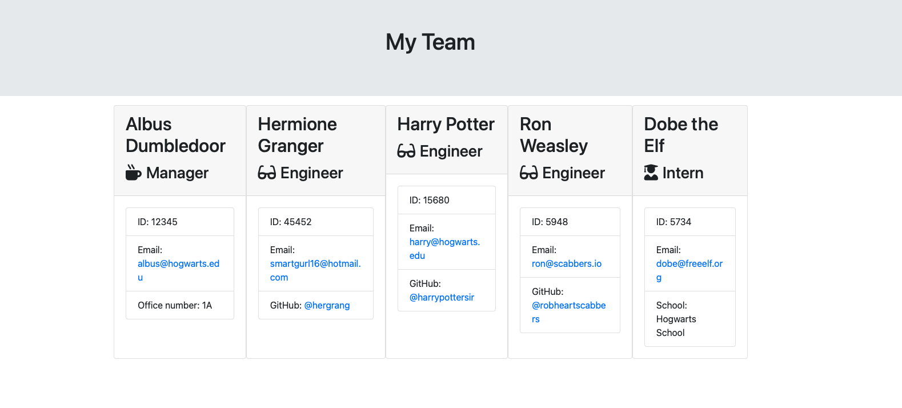

# Team Profile Generator
For UCI Bootcamp - generate a team html page with custom information provided with a handy CLI!

Download the app and in the directory run `node app.js` to begin!

Answer the questions about your team members, then you'll have a brand new HTML with your teams information in the same directory! `./output/team.html`!

Demo of result here:

Demo of CLI [here] (https://www.youtube.com/watch?v=3VXD-FYJgVA)!
